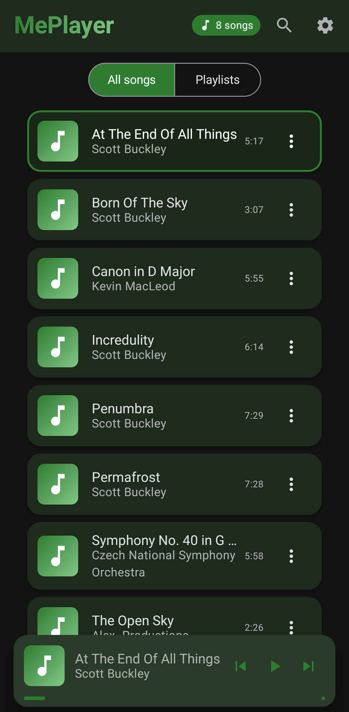
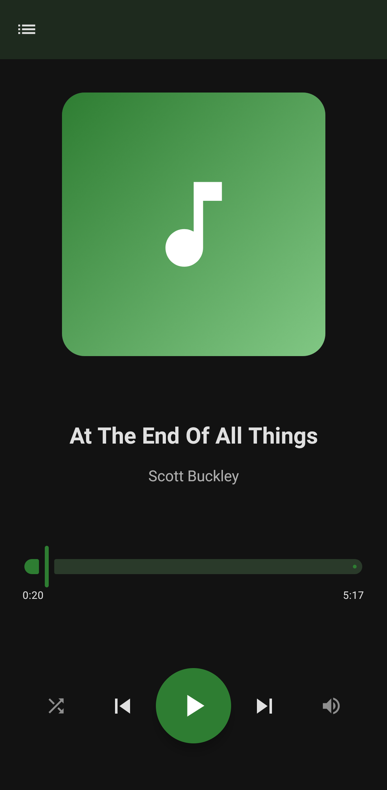
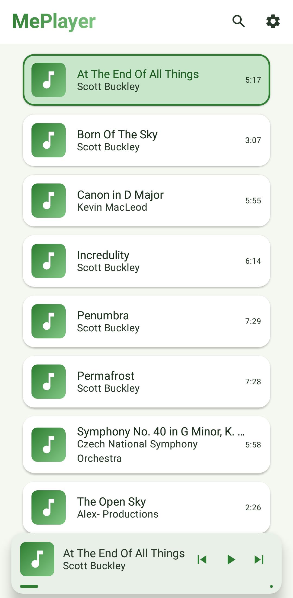
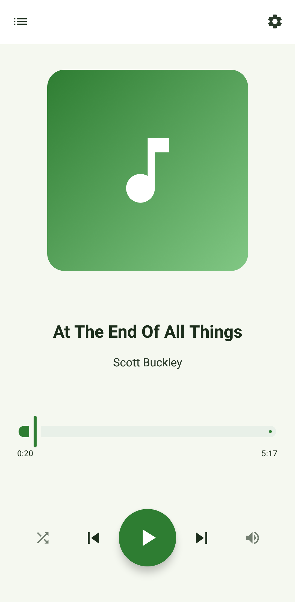

# MePlayer

MePlayer is a beautiful, lightweight, and privacy‑focused music player for Android. Built entirely with **Kotlin** and **Jetpack Compose**, it follows **Material Design 3** guidelines and offers a seamless listening experience without any ads or tracking.

## 📸 Screenshots

<table>
  <tr>
    <td align="center" style="border: none; padding: 8px;">
      
      <br>
      <b>Main Screen (Dark)</b>
    </td>
    <td align="center" style="border: none; padding: 8px;">
      
      <br>
      <b>Player (Dark)</b>
    </td>
  </tr>
  <tr>
    <td align="center" style="border: none; padding: 8px;">
      
      <br>
      <b>Main Screen (Light)</b>
    </td>
    <td align="center" style="border: none; padding: 8px;">
      
      <br>
      <b>Player (Light)</b>
    </td>
  </tr>
</table>

> ⚠️ **Note:** MePlayer is still under active development. Feedback is appreciated!

## 📥 Download
 
[](https://github.com/mmiheev/MePlayer/releases)

## 🚀 Getting Started

### Installation

1. **Clone the repository**
   ```bash
   git clone https://github.com/mmiheev/MePlayer.git
   ```
2. **Open in Android Studio** – Select the cloned folder and wait for Gradle sync.
3. **Run the app** – Connect a device or start an emulator, then click `Run` (▶️).

### Build from command line
```bash
./gradlew assembleDebug
```

## 🛠️ Built With

- [Kotlin](https://kotlinlang.org/) – 100% Kotlin codebase.
- [Jetpack Compose](https://developer.android.com/jetpack/compose) – Modern UI toolkit.
- [Material Design 3](https://m3.material.io/) – Adaptive theming and components.
- [ViewModel](https://developer.android.com/topic/libraries/architecture/viewmodel) – UI state management.
- [Coroutines & Flow](https://kotlinlang.org/docs/coroutines-overview.html) – Asynchronous programming.
- [MediaStore](https://developer.android.com/reference/android/provider/MediaStore) – Querying local audio files.
- [MediaPlayer](https://developer.android.com/reference/android/media/MediaPlayer) – Audio playback.

## 🤝 Contributing

Contributions are what make the open‑source community such an amazing place to learn, inspire, and create. Any contributions you make are **greatly appreciated**.

If you have a suggestion that would make this better, please fork the repo and create a pull request. You can also simply open an issue with the tag "enhancement".

**Steps to contribute:**
1. Fork the Project
2. Create your feature branch (`git checkout -b feature-name`)
3. Commit your changes (`git commit -m 'add some new feature'`)
4. Push to the branch (`git push origin feature-name`)
5. Open a pull request

## 🐛 Bug Reports & Feature Requests

If you encounter any bugs or have an idea for a new feature, please [open an issue](https://github.com/mmiheev/MePlayer/issues). Be sure to include:
- A clear title and description.
- Steps to reproduce (for bugs).
- Screenshots if relevant.
- Your Android version and device model.

## ⭐️ Show your support

If you like MePlayer, please consider giving it a star on GitHub – it helps others discover the project!

## 📧 Contact

[MaxMiheev@proton.me](mailto:MaxMiheev@proton.me) – feel free to reach out!
