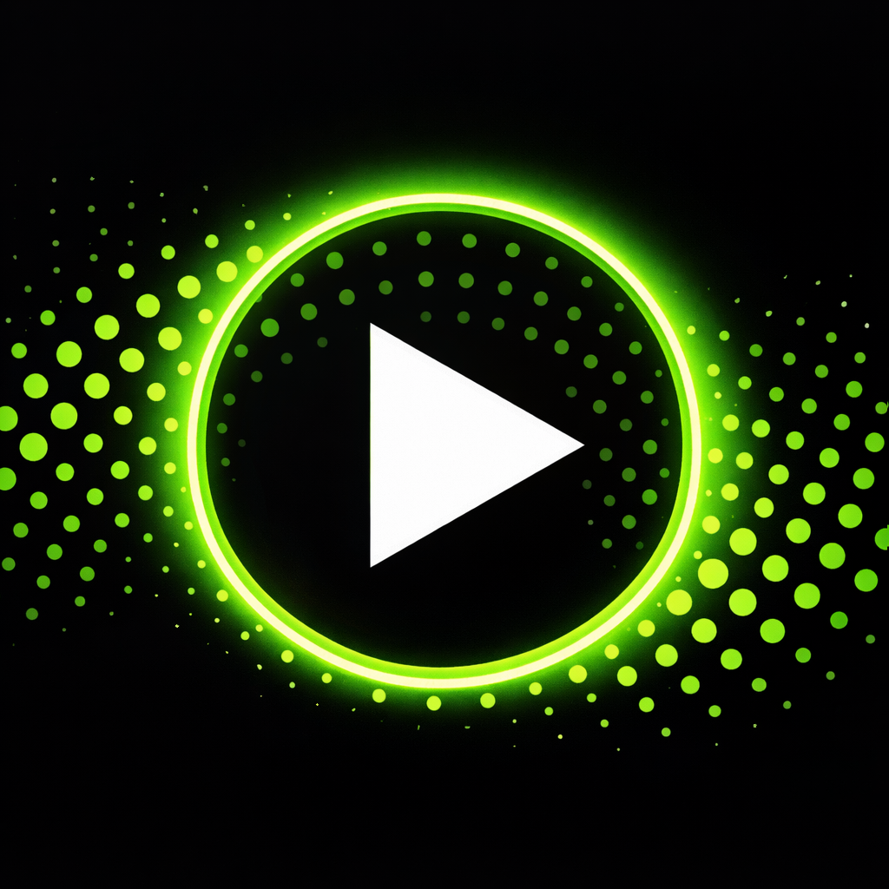
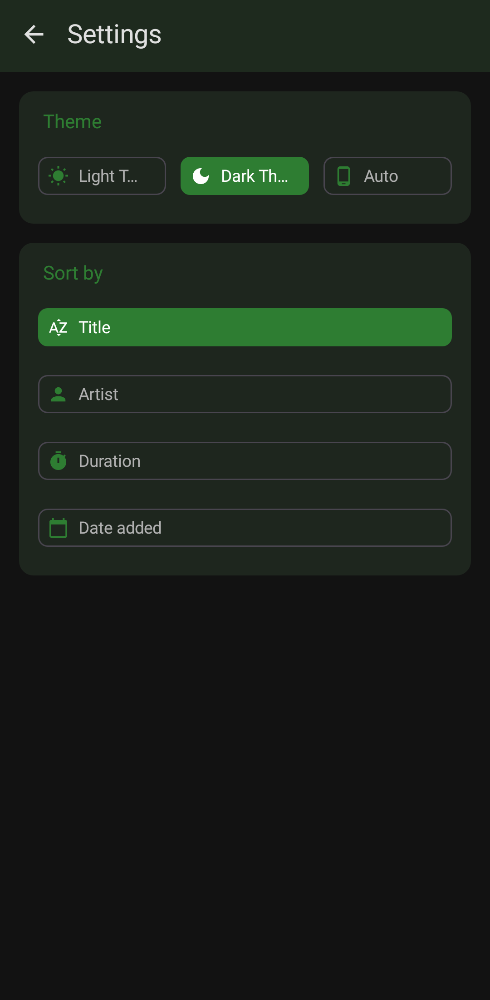
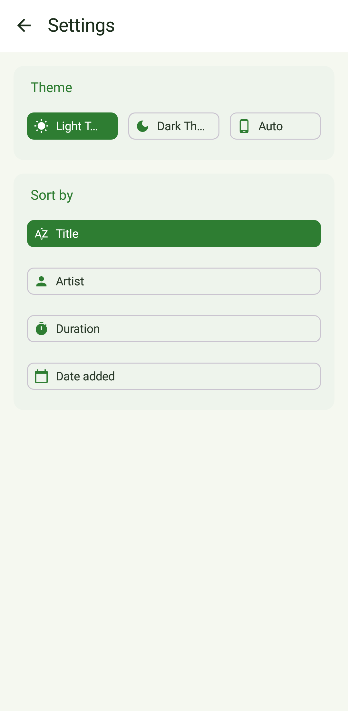

<div align="center">
  
</div>

<h1 align="center">MePlayer</h1>

<div align="center">
  <a href="https://github.com/mmiheev/MePlayer/actions/workflows/android.yml">
    
  </a>
  <a href="https://github.com/mmiheev/MePlayer/releases">
    
  </a>
  <a href="https://github.com/mmiheev/MePlayer/releases/latest">
    
  </a>
</div>

MePlayer is a beautiful, lightweight, and privacy‑focused music player for Android. Built entirely
with **Kotlin** and **Jetpack Compose**, it follows **Material Design 3** guidelines and offers a
seamless listening experience without any ads or tracking.

> ⚠️ **Note:** MePlayer is still under active development. Feedback is appreciated!

## 📸 Screenshots

<table>
    <tr>
        <td align="center" style="border: none; padding: 8px;">
            
            <br>
            <b>Main Screen (Dark)</b>
        </td>
        <td align="center" style="border: none; padding: 8px;">
            
            <br>
            <b>Player (Dark)</b>
        </td>
        <td align="center" style="border: none; padding: 8px;">
            
            <br>
            <b>Settings (Dark)</b>
        </td>
    </tr>
    <tr>
        <td align="center" style="border: none; padding: 8px;">
            
            <br>
            <b>Main Screen (Light)</b>
        </td>
        <td align="center" style="border: none; padding: 8px;">
            
            <br>
            <b>Player (Light)</b>
        </td>
        <td align="center" style="border: none; padding: 8px;">
            
            <br>
            <b>Settings (Light)</b>
        </td>
    </tr>
</table>

## 🛡️ Permissions

MePlayer requires the following permissions for core functionality. All sensitive permissions are
requested at runtime with clear explanations.

| Permission                                                                | Purpose                                        | Security Note                                                                             |
|---------------------------------------------------------------------------|------------------------------------------------|-------------------------------------------------------------------------------------------|
| `READ_MEDIA_AUDIO` (Android 13+) / `READ_EXTERNAL_STORAGE` (≤ Android 12) | Read audio files from device storage.          | Only audio files are accessed; no other media types.                                      |
| `WRITE_EXTERNAL_STORAGE` (≤ Android 9)                                    | Delete audio files when user requests removal. | On Android 10+ deletion uses system dialog (`MediaStore.createDeleteRequest`) for safety. |
| `POST_NOTIFICATIONS` (Android 13+)                                        | Show media playback notification.              | Users can disable notifications in settings.                                              |
| `FOREGROUND_SERVICE` + `FOREGROUND_SERVICE_MEDIA_PLAYBACK`                | Keep playback alive in background.             | Required by Google Play policy; no data access.                                           |

For a detailed explanation of each permission, see the comments in `AndroidManifest.xml`.

## 📥 Download

[](https://github.com/mmiheev/MePlayer/releases)
[](https://apps.obtainium.imranr.dev/redirect?r=obtainium://add/https://github.com/mmiheev/MePlayer)

## 🚀 Getting Started

### Installation

1. **Clone the repository**
   ```bash
   git clone https://github.com/mmiheev/MePlayer.git
   ```
2. **Open in Android Studio** – Select the cloned folder and wait for Gradle sync.
3. **Run the app** – Connect a device or start an emulator, then click `Run` (▶️).

### Build from command line

```bash
./gradlew assembleDebug
```

## 🛠️ Built With

- [Kotlin](https://kotlinlang.org/) – 100% Kotlin codebase.
- [Jetpack Compose](https://developer.android.com/jetpack/compose) – Modern UI toolkit.
- [Material Design 3](https://m3.material.io/) – Adaptive theming and components.
- [ViewModel](https://developer.android.com/topic/libraries/architecture/viewmodel) – UI state
  management.
- [Coroutines & Flow](https://kotlinlang.org/docs/coroutines-overview.html) – Asynchronous
  programming.
- [MediaStore](https://developer.android.com/reference/android/provider/MediaStore) – Querying local
  audio files.
- [ExoPlayer](https://developer.android.com/media/media3/exoplayer) – Audio playback.

## 🤝 Contributing

Contributions are what make the open‑source community such an amazing place to learn, inspire, and
create. Any contributions you make are **greatly appreciated**.

If you have a suggestion that would make this better, please fork the repo and create a pull
request. You can also simply open an issue with the tag "enhancement".

**Steps to contribute:**

1. Fork the Project
2. Create your feature branch (`git checkout -b feature/name`)
3. Commit your changes (`git commit -m 'add some new feature'`)
4. Push to the branch (`git push origin feature/name`)
5. Open a pull request

## 🐛 Bug Reports & Feature Requests

If you encounter any bugs or have an idea for a new feature,
please [open an issue](https://github.com/mmiheev/MePlayer/issues). Be sure to include:

- A clear title and description.
- Steps to reproduce (for bugs).
- Screenshots if relevant.
- Your Android version and device model.

## ⭐️ Show your support

If you like MePlayer, please consider giving it a star on GitHub – it helps others discover the
project!

## 📧 Contact

[MaxMiheev@proton.me](mailto:MaxMiheev@proton.me) – feel free to reach out!